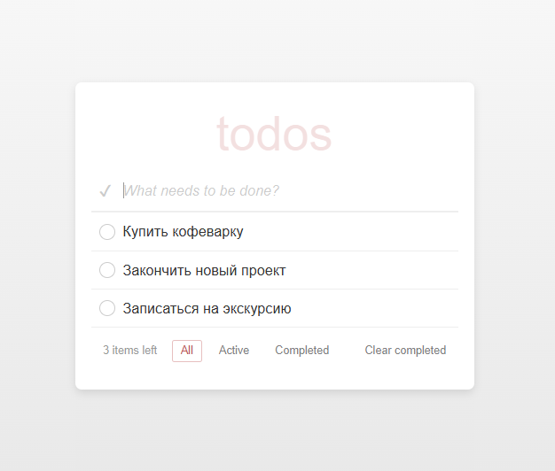

# 📋 Todo App

Простое приложение для управления списком дел, созданное с помощью React и TypeScript.

## 🚀 Функционал
- Добавление новых задач ✅
- Отметка задач как выполненных ☑️
- Фильтрация задач (все, активные, выполненные) 🔍
- Удаление завершённых задач 🗑️
- Поддержка тестирования с Jest + React Testing Library 🧪

## 🛠️ Установка и запуск

### 1. Клонирование репозитория
```sh
git clone https://github.com/OllgaKharina/Todo.git
cd Todo
```

### 2. Установка зависимостей
```sh
npm install
```

### 3. Запуск приложения
```sh
npm start
```
Открой [http://localhost:3000](http://localhost:3000) в браузере.

## 🧪 Запуск тестов
Приложение использует **Jest** и **React Testing Library** для тестирования.
```sh
npm test
```

## 📂 Структура проекта
```
📦 src
 ┣ 📂 components      # Компоненты React
 ┣ 📂 styles          # CSS-стили
 ┣ 📜 App.tsx         # Главный компонент
 ┣ 📜 Todo.tsx        # Компонент одной задачи
 ┣ 📜 types.ts        # Типы TypeScript
 ┣ 📜 index.tsx       # Точка входа в приложение
 ┗ 📜 App.test.tsx    # Тесты приложения
```

## 📜 Основные технологии
- **React** (функциональные компоненты, хуки)
- **TypeScript** (типизация)
- **CSS** (стилизация компонентов)
- **Jest + React Testing Library** (тестирование)

## 📌 Скриншот



